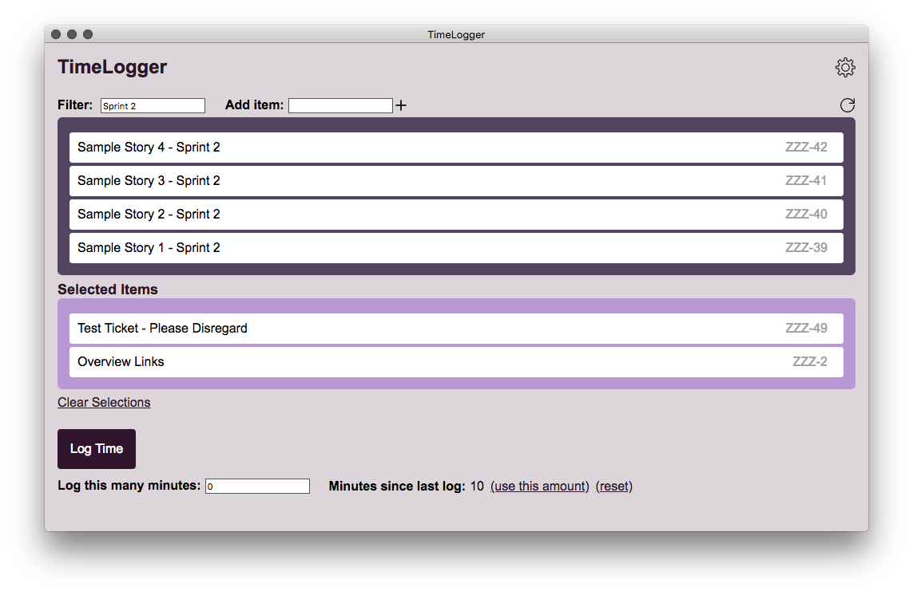
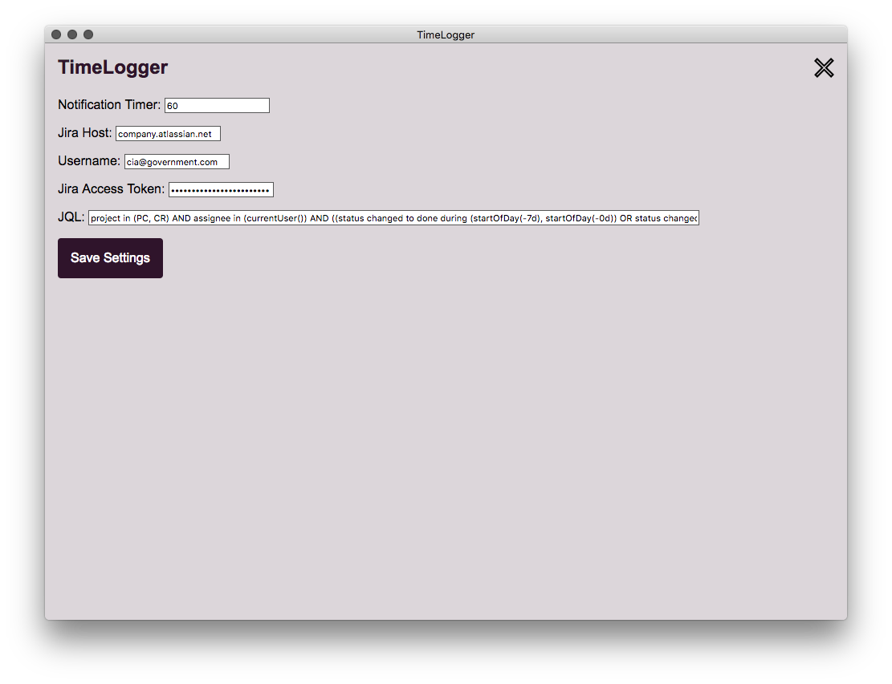

# Timelogger

App to make logging time less painful

## Features
* Customize JQL for your visible items
* Filter items by name / key
* Notifications on a customizable schedule
* It's purple
* Keeps track of time since your last log
* Log to multiple items at once
* You can click on the items and they'll move in between the two different colored boxes it's a lot of fun
* Automatic updates

## Usage
Download the latest releast from https://github.com/pshah28/timelogger/releases, will automatically update when new versions are released

You will need:
* Jira Host - \<company\>.atlassian.net
* Jira Username - the email you use to log in
* Jira API Token - https://id.atlassian.com/manage-profile/security/api-tokens

## Local Development

Clone the repo, run `yarn` to install dependencies, `yarn start` to start the app.

Started with this thing: https://github.com/kitze/react-electron-example
